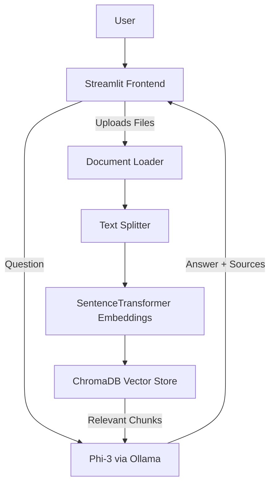

# 📘 AI Knowledge Base Agent  

### Upload → Index → Ask → Instant Answers (100% Local using Phi-3 + LangChain + ChromaDB + Streamlit)

<p align="left">
  
  
  
  
  
</p>

---

## 🚀 What is AI Knowledge Base Agent?

**AI Knowledge Base Agent** is a powerful **local document Q&A system** that runs entirely **offline** using:

- 🧠 **Microsoft Phi-3 (via Ollama)**
- 🔍 **LangChain RetrievalQA**
- 🗂️ **ChromaDB vector store**
- 📄 **PDF/TXT/DOCX document ingestion**
- 🧩 **SentenceTransformer embeddings**
- 🎨 **Interactive Streamlit UI**

You upload documents → The app indexes them → You ask questions →  
The AI gives accurate answers with sources — all **offline** and **private**.

---

## ✨ Key Features

- 📄 **Upload multiple documents** (PDF/TXT/DOCX)  
- ⚙️ **Automatic text extraction & smart chunking**  
- 🔍 **Semantic search using vector embeddings**  
- 🤖 **Local LLM (Phi-3) for instant answers**  
- 📎 **Source documents shown with every answer**  
- 🎨 **Dark/Light mode UI**  
- 💬 **Chat-style interface with typing animation**  
- 💾 **Optional chat history saving**  
- 📥 **Export full chat as PDF**  
- 🔐 **Works 100% offline — all data stays on your system**

---

## 🖥️ Screenshots

| Home Page | Ask a Question |
|----------|----------------|
|  |  |

*(Rename images if needed)*

---

## 🧠 Architecture Diagram



---

## 📦 Installation Guide

### 1️⃣ Clone the repository
```
git clone https://github.com/preethrene/AI_Knowledge_Base_Agent.git
cd AI_Knowledge_Base_Agent
```

### 2️⃣ Install dependencies
```
pip install -r requirements.txt
```

### 3️⃣ Install Phi-3 in Ollama
```
ollama pull phi3
```

### 4️⃣ Run the application
```
streamlit run app.py
```

---

## 📁 Project Structure

```
AI_Knowledge_Base_Agent/
│── app.py
│── requirements.txt
│── chat_history.json
│── screenshots/
│   ├── screen1.png
│   ├── screen2.png
│── chroma_db/   (auto-generated, ignored in Git)
└── README.md
```

---

## 🤝 Contributing

Pull requests are welcome!  
If you'd like to contribute improvements, features, or bug fixes, feel free to fork and submit a PR.

---

## 📝 License

This project is licensed under the **MIT License**.  
© Preetham N

---

## ⭐ If you like this project…
**Please consider giving it a star on GitHub — it motivates development!**


